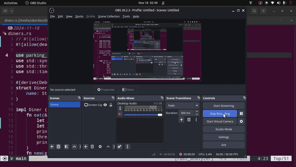

# algorithms_in_rust

Repo to practice the implementation of variety of
basic to advanced algorithms in rust

The examples practiced in this repo are being used
in the medium articles under the
[Rust in Linux with Cuda and LLM](https://medium.com/@kamaljp/list/rust-in-linux-with-cuda-llm-703a8526d1fe)

There are exercises in threading which will be
understood once we see how the output look.

- **diners problem**

[code for below output](./core_prac/core_prac7/src/bin/diners.rs)

