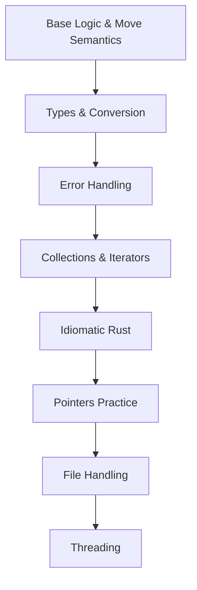

### Core Practice For Rust

##### Objective of the Practice:

- To become fluent in reading the code written by other programmers. Compile and execute their code efficiently. 

- Write Rust code for the logic that is required for solving challenges efficiently, and at speed

- Maintain the Flow State whenever solving a challenge in Rust

##### Core Areas of Practice:

### Where to collect the Practice Ideas

> - Review the rustlings exercises 
> 
> - Review the various dive-in files taken from GPT
> 
> - Look at the LGR Examples

### How to collect the practice Ideas

> - Decide on the Theme / area to be practiced
> 
> - Under that area create atleast 10 different practice steps, ranging from easy to tough
> 
> - Dive-in files taken from GPT, they have comments which are practice steps
> 
> - We can directly **ask to GPT for the Practice Ideas**, and start implementing them, instead of manual process
> 
> - Completing the 57 Exercises seems to  be a good way to practice a lot of techniques
